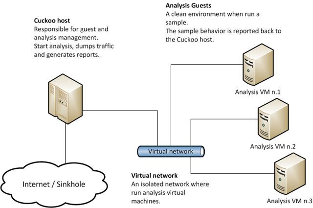

# 基于深度学习的恶意行为检测

## 使用CNN进行样本恶意动态行为检测

### 恶意代码检测

- 目前的恶意样本检测方法可以分为两大类：静态检测和动态检测
    - 静态检测：不实际运行样本，直接根据二进制样本或相应的反汇编逆向代码进行分析，这就使这种恶意代码的检测方法容易受到变形、加壳、隐藏等方式的干扰
    - 动态检测：是指将样本在cuckoo沙箱环境中运行，根据样本对操作系统的资源调度情况进行分析。现有的动态行为检测都是基于规则对行为进行打分，分值的高低代表恶意程度的高低，但是无法给出类别定义

### 深度学习

- CNN（卷积神经网络）
- 借助CNN在自然语言处理方面的研究成果，进行样本的恶意动态行为检测
- 不需要人工提取特征向量，具体的特征是算法根据样本的动态行为信息自行学习的

### 环境配置

- cuckoo沙箱的部署（分为host和guests）



- Host（管理机）
    - 负责管理guests、启动分析工作、网络流量收集等。
    - host依赖一些开源软件，例如tcpdump用于Guest网络拦截、Volatility用于内存的dump。
- Guest（虚拟机）
    - 负责运行Cuckoo的Agent，接收Host发过来的任务（文件）运行后获取信息。
    - Agent是跨平台的Python脚本，它实际是一个XMLRPC server，等待连接。

#### 一. Host环境搭建

1. 安装Cuckoo

```bash
$ sudo pip install -U pip setuptools
$ sudo pip install -U cuckoo
```

2. 数据库依赖库
    - 如要使用Cuckoo sandbox自带web程序，需安装mongodb；
    - Cuckoo sandbox默认使用sqlite数据库，如要使用mysql，需安装mysql和MySQL-python。
3. 网络数据包捕获
    - Host使用tcpdump捕获网络数据包 
        - 安装tcpdump

```bash
    $ sudo apt-get install tcpdump
```

- 启用root账户

```bash
    $ sudo setcap cap_net_raw,cap_net_admin=eip /usr/sbin/tcpdump
```

- 验证启用是否成功

```bash
    $ getcap /usr/sbin/tcpdump /usr/sbin/tcpdump=cap_net_admin,cap_net_raw+eip
```

#### 二. Guest环境搭建

- 使用win7系统，需要关闭User Access(用户账户控制)，否侧环境搭建失败
- 关闭Windows自动更新
- 关闭Windwos防火墙
- 保证Python的运行环境
- 网络环境配置
    - 使用Host-Only网卡
    - 将主机网络地址配置到Host-Only网段
    - 保证Host和Guest能相互ping通（正常通信）
    - 将主机配置到能访问外部网络环境（Cuckoo sandbox使用iptables配置转发规则）

- 安装agent . py
    - 将agent目录下的agent.py拷贝至win7文件系统
    - 将agent.py修改成agent.pyw，并添加至开机启动项,agent.pyw为无界面模式
    - 运行agent.pyw

#### 三. 样本分析  

- 启动Cuckoo服务

```bash
$cuckoo
```

- 开启web服务

```bash
$cuckoo web runserver
```

- 打开浏览器,输入网址127.0.0.1:8000进入web操作界面。


- 上传测试样本后跳转到样本分析设置界面


- 提交测试后，有pending、running、completed、reported等多种状态。运行完，会显示reported状态。


- 进入测试报告后可获取
    - 显示可测试后样本的行为，有数字的部分表示样本有对应的行为
    - 展示样本的基本信息
    - 样本运行的基本信息
    - 样本运行时的屏幕截图


### 数据的预处理

- 通过在cuckoo沙箱运行样本，获取样本的动态行为报告。样本在实验中受限于两个条件（保证实验的顺利进行，否则后期无法进行准确的分类）
    - 1）样本能跑出动态行为
    - 2）该样本在VirtusTotal上能查询到对应结果
- 部分样本的动态行为报告格式


- 多分类样本分别占比


- 对于每一个样本，其原始的动态行为报告是json结构数据。为了便于使用，将原始报告转为文本格式
- 每个样本的行为由一个txt文档表示，文档中的每一行表示一个api调用。每一行分为三个部分，由空格分隔
    - 第一部分是api类型，对应原始report.json中的category字段
    - 第二部分是调用的api名称
    - 第三部分是调用过程中的相关参数

- 在实际实验过程中发现，不考虑参数信息时算法效果更好，所以去除了动态行为的参数信息
- 最终使用时对于相邻的重复api调用只考虑一次，相当于去重处理


- 经过数据的预处理和检测报告的格式转化后，就可以直接对文本进行分类
- 多分类中将恶意样本一共分为Trojan（木马）、Worm（蠕虫）、Backdoor（后台程序）、Virus（病毒）、Adware（广告）、Others、White

### 算法的具体实现

#### 1. 获取词库

- 在动态行为文本中，每一行表示一个动态行为，将一行视为一个整体，遍历所有的动态行为日志，获取所有出现过的动态行为，作为词库
- 用连续数字对词库中的每一个词进行标号，这样可以获取动态行为到标号id的映射
- 除了出现过的动态行为外，还添加了一个“Unknown”的动态行为，用于之后匹配不在词库中的未知行为


#### 2. 将样本转化为矩阵表示

- 使用CNN进行文本分类时首先需要将文本转为类似图片的二维矩阵（利用其算法在对自然语言处理方面的特性和优势）
- 为了实现文本的矩阵表示，先将词库中的每一个词用一个长度固定的向量表示，这个向量长度是一个可以选择的参数。初始化向量时采用随机初始化，之后会随着训练不断更新词向量
- 对于每一个样本，将样本中的动态行为根据词库转换为对应的id序列。再根据此id序列以及词库中每个id的向量将样本转换为二维矩阵
- 在转换过程中需要制定最大词长度，以保证所有样本转换后的矩阵有相同的维度，便于分析
    - 对于长度不足的样本需要在最后用0补齐
    - 对于超长的样本，直接截断即可


#### 3. 使用CNN开始样本训练

- 对于输入的样本矩阵，分别用多个卷积核进行卷积
- 卷积核的长度可以是任意选择的，首先输入是7×5的矩阵，7表示有7个词，5表示每个词的维度，然后进行卷积运算，这里他有3中不同尺寸的卷积核，分别是 2×5, 3×5 , 4×5，并且每种卷积核都有2个，一定是宽度一定是5，不然做矩阵运算的时候，会报错。
- (7×5)的输入矩阵，用(2×5)的卷积核进行卷积，得到的结果是(6×1)的向量，6=句子长度-卷积核长度+1，同理，用(3×5)的卷积核得到的结果是(5×1)的向量，用(4×5)的卷积核得到的结果是(4×1)的向量
- 对(6×1)的向量做最大池化，其实就是取最大值，那就变成了1个标量，所以一个卷积核最后就得到了一个标量
- 这里有6个卷积核，所以最后的结果就是(6×1)的向量，这个向量也就是文本表示
- 最后过一个全连接层，就相当于一个分类器做分类了，整个过程结束
- 例如(3, 4, 5)，即使用了3个不同长度的卷积核。卷积核的宽度与词向量的长度相同。这样经过一次卷积操作后，原本的二维矩阵就会变成一个列向量。这种处理类似于N-Gram算法，取长度为3的卷积核其实就是对相邻的3个动态行为提取特征。每一种尺度的卷积核都可以有多个
- 经过卷积后，再对每一个卷积结果使用max-pooling，取列向量中的最大值。这样每一个列向量就转变成了一个1×1的值。将所有卷积核结果对应的最大值连接在一起构成全连接层。最后还可以用softmax进行多分类处理。


- 引用了[论文](https://arxiv.org/abs/1408.5882)中cnn处理NLP的原理流程图

- 在实现cnn时采用Tensorflow实现算法结构。
- Embedding是词嵌入部分，即将动态行为文本转换为二维矩阵，conv卷积操作，pool对应max-pooling，fc为全连接层，最后结果由softmax输出。
- 加入了batchnorm和学习速率指数衰减，用以加速学习和优化结果。
- 有一个dropout层，但实际使用时keep_prob传入的是1.0，即并没有进行dropout。该层是在调试结果时使用的。
- 测试二分类和多分类效果。
    - 二分类是指只判断样本的行为是否为恶意的。
    - 多分类指将样本根据动态行为划分为7类。


### 代码执行

1. 格式转换json->txt
    - 将原始cuckoo跑出的动态行为报告report.json都拷贝到文件夹data/cuckoo_reports中
    - 用下面指令转换cuckoo报告格式（json->txt）,结果保存在data/cuckoo_report_txts中  

```bash
python cuckoo2txt.py
```

2. 准备训练样本  
    - 把转换为txt格式的动态行为报告，根据类别存放到data/train下的不同目录。  
    - 二分类，分别把样本存入data/train/pos和data/train/neg

3. 训练样本  

    - main函数中有可调节的参数，可根据需要直接修改进行样本的训练。

```bash
python train.py
```

4. 测试

    - 将txt格式的测试文件存入data/test子目录下

```bash
python test.py
```

5. 查看tensorboard

```bash
tensorboard --logdir runs/
```

### 实验结果

#### 二分类结果

- 只对样本的动态行为进行好与坏的分类
- 蓝色线是训练集上结果，红色线是测试集结果。结果在迭代1400个batch后趋于稳定。
- 在训练集上，准确率在98%附近浮动，损失值在0.04附近浮动。
- 在测试集上，准确率最高为93%，但是损失值在迭代400个batch后就开始发散，并没有收敛。


#### 多分类结果

- 在迭代到1600个batch后，算法效果已经基本趋于稳定，训练集准确率在98%附近波动，损失值在0.07附近波动。
- 在测试集上，算法准确率最高点出现在迭代了2600个batch的时候，准确率为89%，损失值也在迭代了400个batch后开始发散。
- 多分类结果目前只支持7类（Trojan、Worm、Backdoor、Virus、Adware、Others、White）


### 参考文献

1. http://citeseerx.ist.psu.edu/viewdoc/download?doi=10.1.1.702.6310&rep=rep1&type=pdf
2. https://www.tensorflow.org/?hl=zh-cn
3. https://pdfs.semanticscholar.org/d3f5/87797f95e1864c54b80bc98e957da6746e27.pdf
4. http://www.aclweb.org/anthology/I17-1026
5. https://ieeexplore.ieee.org/abstract/document/7166115/
6. https://arxiv.org/abs/1408.5882
7. https://www.jianshu.com/p/6ca4fe3f7fb3